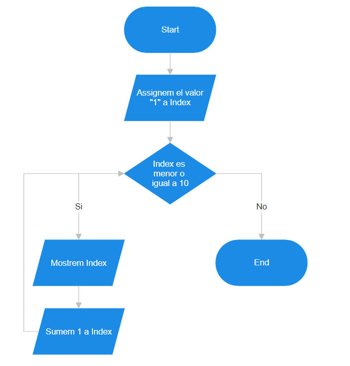
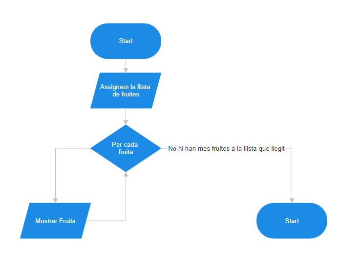
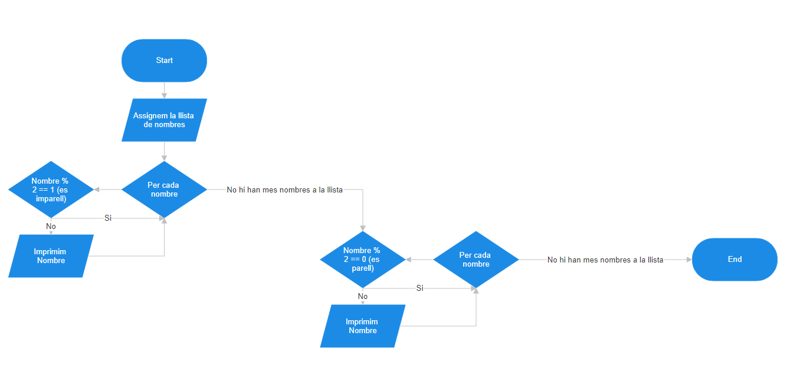
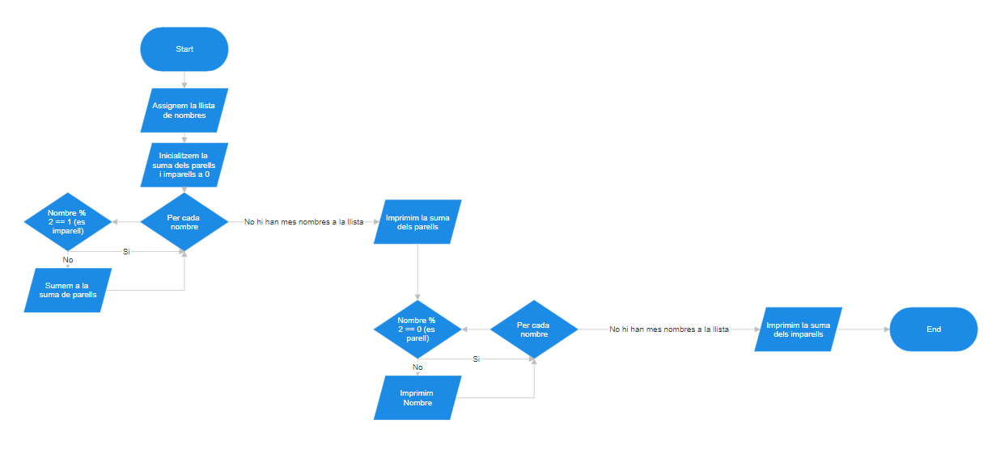
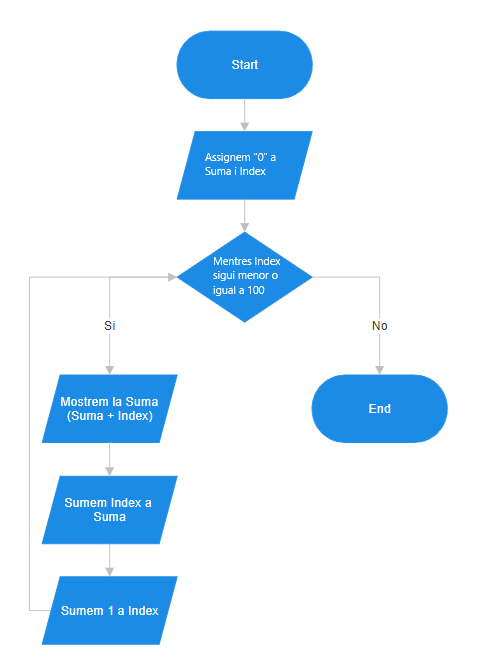

Activitat 1:

Activitat 2:

Activitat 3:

Activitat 4 (les condicions són inverses perque utilitzo guard clauses per filtrar l'invers del que vui ensenyar, per exemple, si vui ensenyar parells filtro els imparells fent nombre % 2 == 1 i ficant un continue per saltarme'ls):

Activitat 5:

Activitat 6:

Activitat 7:

